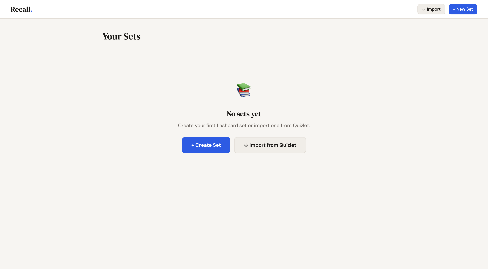
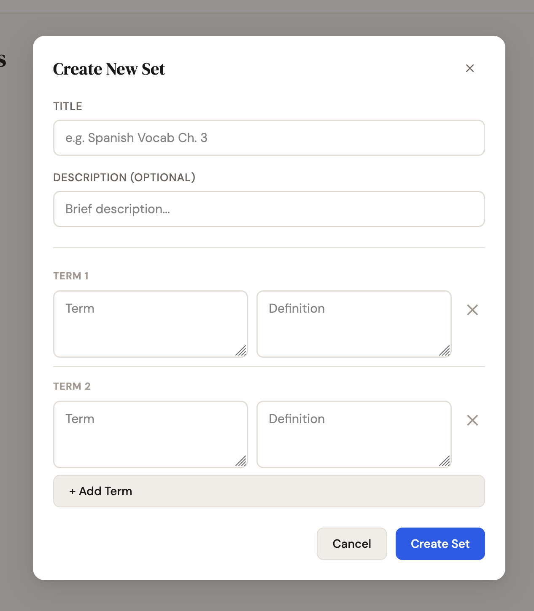
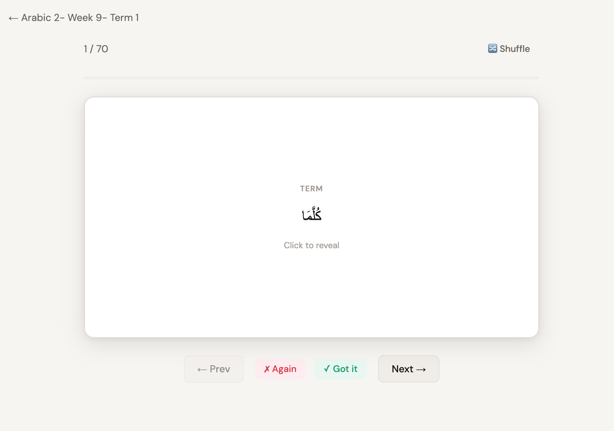
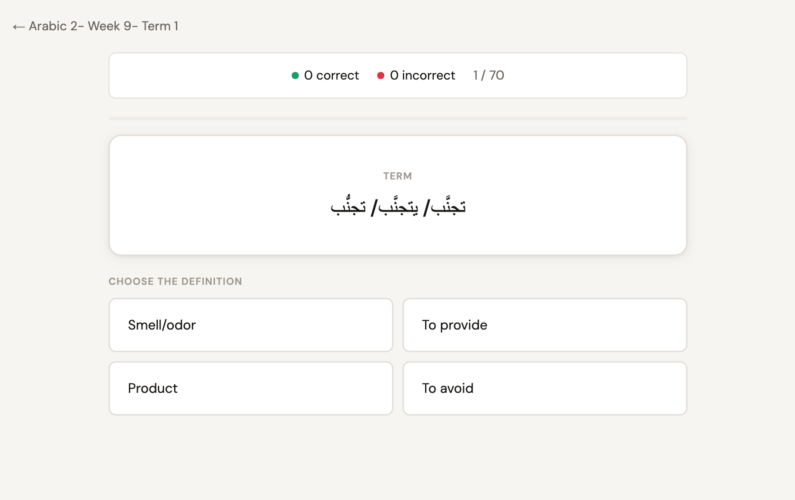
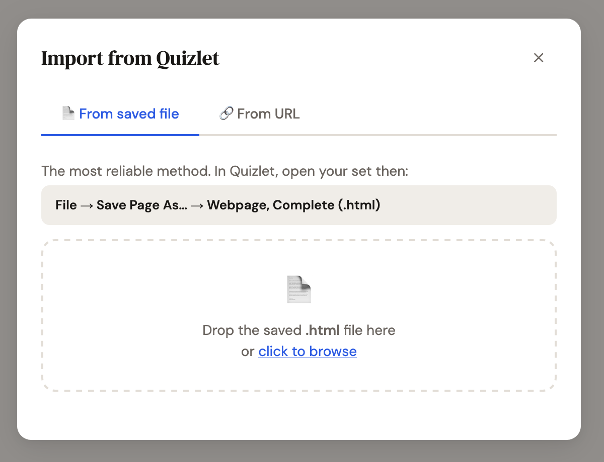

# Recall — Flashcard Study App

A clean, locally-hosted Quizlet clone with flashcards, learn mode, and Quizlet import.

## Quick Start

**Double-click `Recall.command`** in Finder — the app opens in your browser automatically.
You may need to go to **Settings** -> **Privacy and Security** -> **Security** -> **Run app this time**

Or from Terminal:
```
bash start.sh
```

Then open: http://localhost:3747

## Features

- **Flashcards** — Flip through cards, mark as Got It / Again, shuffle
- **Learn** — Multiple choice quiz, tracks wrong answers, retry missed cards
- **Import from Quizlet** — Paste any public Quizlet URL to import cards
- **Progress tracking** — Saved automatically, shown on each set card
- **Create & Edit** — Full set editor, add/remove terms anytime

## Requirements

- **Node.js** — Install from https://nodejs.org or `brew install node`
- No internet needed after first setup (except for Quizlet import)

## Data

All your sets and progress are saved in `data.json` in this folder.
Back it up to keep your data safe.

## Keyboard Shortcuts (Flashcard mode)

- `Space` / `→` — Next card
- `←` — Previous card  
- `F` / `↑` — Flip card

## Screenshots

### Dashboard


### Create Set


### Flashcards


### Learn


### Import

